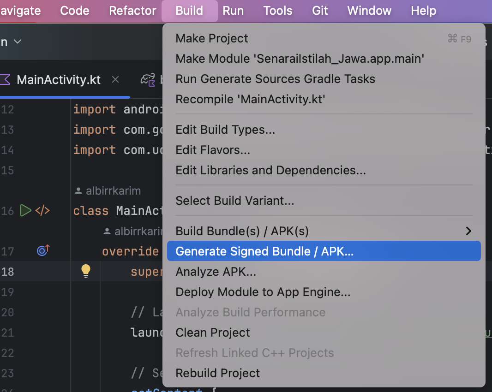

# How to produce Trusted Web Activity (TWA) for your website

## A. Create some Empty Project in android studio

## B. Keystore

The keystore is to sign the APK file. Keystore is to make .aab and .apk file.

**Create keystore file**

```bash

keytool -genkey -v -keystore lab_example.keystore -alias lab_example -keyalg RSA -keysize 2048 -validity 10000

```

**Now we have something like this**

File `lab_example.keystore`

Info:

```bash
alias: lab_example
key store password: example
key password: example
```

**Sign**

**_in same directory_** to get the SHA-256 run this

```bash
keytool -list -v -keystore lab_example.keystore -alias lab_example -storepass example -keypass example | grep SHA256
```

**Make assetlinks.json**

Go [here](https://developers.google.com/digital-asset-links/tools/generator?hl=id) to make the assetlinks.json file

**Upload the assetlinks.json to your website**

Put that file into `https://yourwebsite.com/.well-known/assetlinks.json`

<br/>

## C. Need to write to your code

Shortcut to open file in Android Studio Shift + Cmd + O

File `MainActivity.kt`

```kotlin

package com.example.yourAppName

import android.net.Uri
import android.os.Bundle
import androidx.activity.ComponentActivity
import androidx.activity.compose.setContent
import androidx.compose.foundation.layout.fillMaxSize
import androidx.compose.material3.MaterialTheme
import androidx.compose.material3.Surface
import androidx.compose.material3.Text
import androidx.compose.runtime.Composable
import androidx.compose.ui.Modifier
import androidx.compose.ui.tooling.preview.Preview
import com.example.yourAppName.ui.theme.yourAppNameTheme
import com.google.androidbrowserhelper.trusted.TwaLauncher

class MainActivity : ComponentActivity() {
    override fun onCreate(savedInstanceState: Bundle?) {
        super.onCreate(savedInstanceState)

        // Launch the TWA
        launchTwa("https://example.com")

        setContent {
            yourAppNameTheme {
                // A surface container using the 'background' color from the theme
                Surface(
                    modifier = Modifier.fillMaxSize(),
                    color = MaterialTheme.colorScheme.background
                ) {
                    EmptyScreen()
                }
            }
        }
    }

    private fun launchTwa(url: String) {
        // Create an instance of TwaLauncher and launch the TWA with the specified URL
        val twaLauncher = TwaLauncher(this)
        twaLauncher.launch(Uri.parse(url))

        // Optionally finish the activity so it doesn’t stay in the back stack
        finish()
    }
}

@Composable
fun EmptyScreen() {
    // This can be an empty Composable, or you can show a message or loading screen if needed
}

@Preview(showBackground = true)
@Composable
fun GreetingPreview() {
    yourAppNameTheme {
        EmptyScreen()
    }
}

```

File `build.gradle.kts`

```gradle
dependencies {
    implementation ("androidx.browser:browser:1.4.0")
    implementation ("com.google.androidbrowserhelper:androidbrowserhelper:2.4.0")
}
```

## How to build the APK & AAB file



In google play console you need the `.aab` file

Try to product signed `.apk` release to try on your device.


## Upload to Google Play Console


**Before you upload to Google Play Console**

You need to prepare some information:

- Need some privacy policy page. eg. `https://yourwebsite.com/privacy`
- Need screenshots of the app, at least 3 screenshots

**After google review**

- Need 20 email address, for tester. Then they need to keep the app installed for 14 days.

**Yeay your app ready**